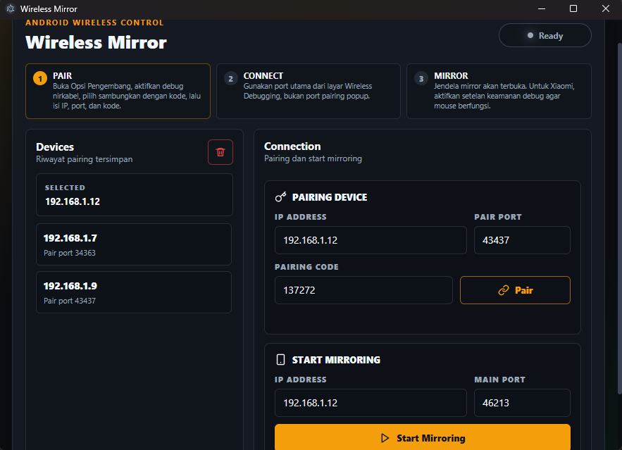

# Wireless Mirror

Wireless Mirror adalah launcher sederhana untuk menjalankan scrcpy wireless di Windows.



## Cara Pakai dari Source

Clone repository:

```bash
git clone <url-repository-anda>
cd Mirror-Android-Wireless
```

Install dependency:

```bash
npm install
```

Jalankan saat development:

```bash
npm start
```

Build aplikasi Windows:

```bash
npm run build
```

Hasil build ada di folder:

```text
dist/Mirror Wireless-win32-x64
```
